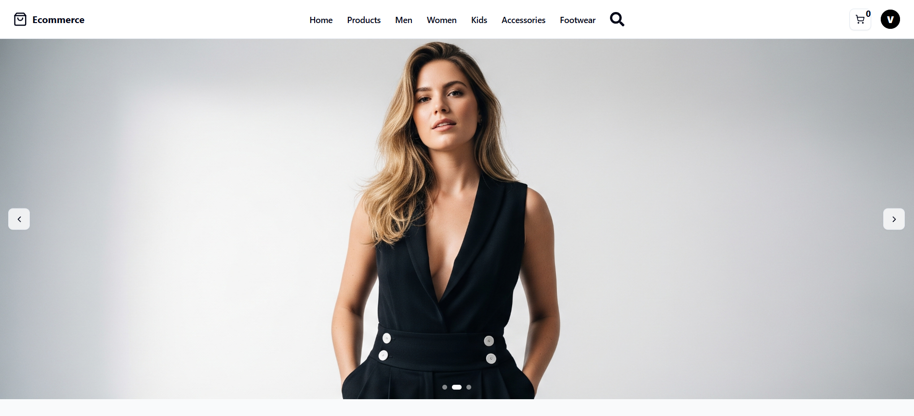
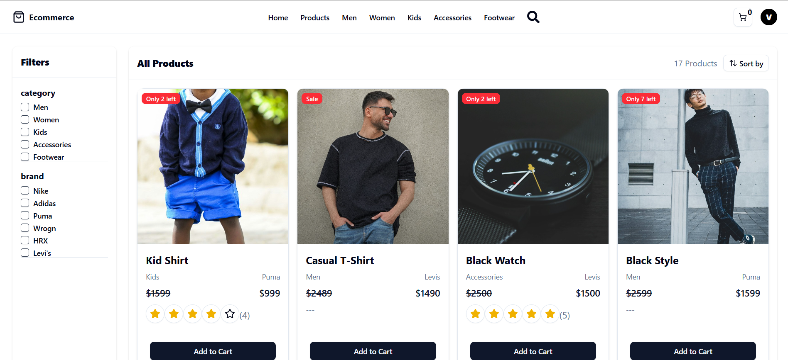
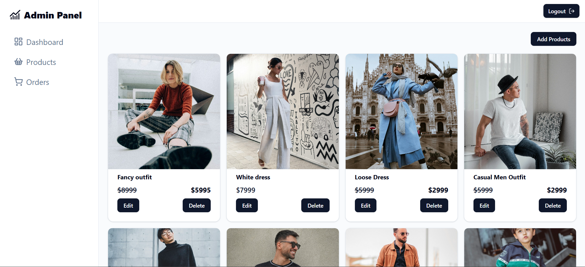

# 🛒 MERN Stack E-commerce Platform

A full-featured e-commerce web application built using the **MERN stack** (MongoDB, Express.js, React, Node.js). This project includes user authentication, product management, shopping cart, order placement, and payment integration.

## 🚀 Live Demo

🔗 [Live Site URL](https://ecommerce-frontend-two-gamma.vercel.app/)  
🔗 [Client GitHub Repo](https://github.com/AdityaReddy96/Ecommerce.git)

---

## 📸 Screenshots

| Home Page                       | Product Details                        | Admin Panel                       |
| ------------------------------- | -------------------------------------- | --------------------------------- |
|  |  |  |

---

## 🧰 Tech Stack

**Frontend**:
- React
- Redux Toolkit
- Tailwind CSS
- Axios

**Backend**:
- Node.js
- Express.js
- MongoDB
- Mongoose

**Services**:
- Authentication: JWT
- Image Hosting: Cloudinary
- Payment Gateway: PayPal Sandbox
- Deployment: Vercel (Frontend & Backend)

---

## ✨ Features

- User Registration & Login
- Admin Dashboard
- Product CRUD Operations
- Shopping Cart
- Order Checkout
- Payment Integration
- Product Reviews
- Filtering & Sorting
- Responsive UI

---

## 🏗️ Folder Structure

Ecommerce/
├── client/          # React frontend
│   ├── public/
│   ├── src/
│   └── ...
├── server/          # Express backend
│   ├── controllers/
│   ├── models/
│   ├── routes/
│   └── ...
├── screenshots/     # Application screenshots
└── README.md

---

### 🛠️ Installation

# 🛒 MERN Stack E-commerce Platform

A full-featured e-commerce web application built using the **MERN stack** (MongoDB, Express.js, React, Node.js). This project includes user authentication, product management, shopping cart, order placement, and payment integration.

## 🚀 Live Demo

🔗 [Live Site URL](https://ecommerce-frontend-two-gamma.vercel.app/)  
🔗 [Client GitHub Repo](https://github.com/AdityaReddy96/Ecommerce.git)

---

## 📸 Screenshots

| Home Page                       | Product Details                | Admin Panel                   |
|---------------------------------|---------------------------------|-------------------------------|
|  |  |  |

---

## 🧰 Tech Stack

**Frontend**:
- React
- Redux Toolkit
- Tailwind CSS
- Axios

**Backend**:
- Node.js
- Express.js
- MongoDB
- Mongoose

**Services**:
- Authentication: JWT
- Image Hosting: Cloudinary
- Payment Gateway: PayPal Sandbox
- Deployment: Vercel (Frontend & Backend)

---

## ✨ Features

- ✅ User Registration & Login
- 🔒 Admin Dashboard
- 🛍️ Product CRUD Operations
- 🛒 Shopping Cart
- 💳 Order Checkout
- 💰 Payment Integration
- ⭐ Product Reviews
- 🔍 Filtering & Sorting
- 📱 Responsive UI

---

## 🛠️ Installation

### Prerequisites
- Node.js (v14 or later)
- npm (comes with Node.js)
- MongoDB Atlas account or local MongoDB

### Setup Instructions

1. **Clone the repository**
   ```bash
   git clone https://github.com/AdityaReddy96/Ecommerce.git
   cd Ecommerce

2. **Install Dependencies**

# Backend
cd server
npm install

# Frontend
cd ../client
npm install

3. **Setup Environment Variables**

Create a .env file in both client/ and server/ as shown above.
Use MongoDB Atlas or your local MongoDB URI.

# Server `.env`
```env
PORT=PORT_NUMBER
MONGO_URI=your_mongodb_connection_string
JWT_SECRET=your_jwt_secret
CLOUDINARY_CLOUD_NAME=your_cloud_name
CLOUDINARY_API_KEY=your_api_key
CLOUDINARY_API_SECRET=your_api_secret
PAYPAL_CLIENT_ID=your_paypal_client_id
PAYPAL_SECRET_KEY=your_paypal_secret_key
```

# Client `.env`
```env
VITE_BACKEND_URL=your_backend_url
```

4. **Run the application**
# Backend (in one terminal)
cd server
npm run dev

# Frontend (in another terminal)
cd ../client
npm run dev

Client will start at http://localhost:5173
Server will run on http://localhost:5000

🙋‍♂️ Author

Aditya Reddy
📧 adityareddy393@gmail.com
🔗 [LinkedIn](https://www.linkedin.com/in/aditya-reddy-66847b314)
🔗 [Portfolio](https://portfolio-three-rust-79.vercel.app/)